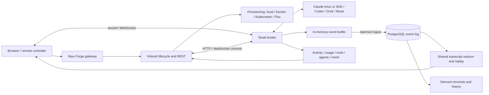

# Forge stability review — 2026-09-07

## Assessment

Forge has a substantial reliability foundation, but it is **not yet ready for a
claim of faultless remote sessions**. The shared transcript reducer, log replay,
steering correlation, native Claude session identity, and real tmux harness are
valuable foundations. This review found reproducible failures in persistence,
transport lifecycle, question delivery, and the verification pipeline despite
that existing coverage. The fixes and new gates in this change address specific
failures; the release blockers below remain explicit.

The most consequential remaining work is durable capture across process death,
bounded delivery to slow clients, truthful transport capabilities, recovery from
permanent ingest rejection, and credentialed acceptance for each actual provider
runtime. Functional browser tests and fake protocol peers cannot establish those
properties on their own.

Companion: [test matrix and operating workflow](forge-stability-workflow.md).

## Scope and evidence boundaries

- Working branch: `skuld-agent-tokens`, starting at `ce7ee1ea`.
- Existing user changes included Muse transport/configuration/catalog/UI work.
  They were preserved and reviewed as work in progress. The new fault tests also
  exercise that implementation. No branch checkout, merge, reset, commit,
  deployment, or credentialed provider turn was performed for this review.
- Both remotes were fetched without pruning. Branch comparisons use the resulting
  refs, not just the initial local branch listing.
- Inspected: `src/skuld`, the shared transcript reducer, Forge REST/replay and
  lifecycle services, related database adapters, channel dispatch, browser socket
  and session surfaces, charts/container wiring, tests and CI workflows.
- The review includes the Forge-facing Ravn/flock/mesh path. It is not an audit of
  every algorithm or unrelated service in this monorepo. In particular, the
  historical branches were compared, not individually built and executed.
- “Scaldi” is treated as Skuld (older Grok history also calls it Scaldy), and
  “Teamox” as the repository's Claude tmux transport.
- Provider API/model/pricing claims in existing source comments were not externally
  validated. No real-model compatibility claim follows from this review.

## Branch reconciliation

Counts below are unique commits in `HEAD...branch` at the reviewed starting HEAD:
left is current-branch-only, right is comparison-branch-only. Counts are ancestry,
not a measurement of functional differences: cherry-picks and adapted patches
can produce different hashes and even different patch IDs.

| Branch/ref                             | Tip        | Current only / other only | Review conclusion                                                                                     |
| -------------------------------------- | ---------- | ------------------------: | ----------------------------------------------------------------------------------------------------- |
| `origin/main`                          | `c09ec3e5` |                   570 / 0 | Too old to represent the active Forge integration baseline.                                           |
| `origin/dev`                           | `ffe18de5` |                   139 / 0 | Ancestor; contains original native Codex compaction work.                                             |
| `Lexi/sol-review`                      | `3632ca18` |                    13 / 0 | Native Claude session-id fix is inherited.                                                            |
| `lexi/cli-tmux-questions`              | `1e194648` |                    68 / 0 | Comprehensive tmux harness is inherited, but its historical green result was stale.                   |
| `lexi/forge-steering`                  | `e6f83011` |                   134 / 0 | Original steering work is inherited.                                                                  |
| `lexi/forge-state-reporting`           | `dfae0541` |                   129 / 0 | Server activity-state work is inherited.                                                              |
| `lexi/forge-replay-as-live`            | `c4c88e3a` |                   132 / 0 | Replay work is inherited; later reducer changes matter more than its tip alone.                       |
| `skuld-grok-acp`                       | `eb265338` |                   141 / 7 | Diverged historical Grok work; current branch has later native Grok fixes. Do not merge it wholesale. |
| `lexi/slash-command-passthrough`       | `198bbdb0` |                   141 / 6 | Related historical Grok work; reconcile by behavior.                                                  |
| `dev-integration` / `lexi/ravn-rooms`  | `df1566e6` |                 102 / 604 | Substantial independent platform, credential and broker-module work.                                  |
| `upstream/feat/forge-reliability-pass` | `19c36029` |                  281 / 36 | Earlier reliability work, partly represented by adapted changes here.                                 |
| `upstream/dev`                         | `c54ed6ac` |                 102 / 614 | Newer integration work, including durability refusal and another runtime.                             |

The common base of current HEAD and `dev-integration` is `2568a42d`.
`git cherry HEAD dev-integration` includes both equivalent and non-equivalent
patches; matching subject lines are not sufficient evidence of inclusion.

### Changes that should guide the next reconciliation

1. `3978c6be` on upstream refuses to run a configured durable log whose head cannot
   be fetched, and terminates on permanent ingest rejection. This review adapts
   the **startup-head policy** to the current monolithic broker and adds malformed
   head checks. It does not import the upstream SIGTERM policy wholesale.
2. `6a00c036` aligns the replay-cache test with its tail-id tuple and ships embedded
   migration 62. The stale cache assertion was independently confirmed here and
   corrected. Compare embedded migration packaging before distributing a binary.
3. `ff611609` fixes Codex broker delivery on the Flux provisioning path;
   `407173e8` adds credential brokering. These are deployment/credential features
   that require dedicated cluster and auth acceptance, not just transport tests.
4. `dev-integration` splits `broker.py` into event-log, lifecycle, activity,
   file-route, authentication and workflow modules. Port the behavior tests first
   and then adapt fixes at the extracted ownership boundaries. Copying an 8,000+
   line broker over that branch would discard independent work.
5. The upstream event-log implementation inspected still removed `len(batch)`
   after posting. The overflow/concurrent-flush fix here must be carried forward
   even when adopting upstream's stricter rejection policy.
6. `5e37ab95` adds another runtime upstream. Any provider added during integration
   must join the same acceptance matrix; adding a factory mapping alone is not
   completion.

### Reliability work already present in this branch

| Changes                                                                | Behavior worth preserving                                                                                           |
| ---------------------------------------------------------------------- | ------------------------------------------------------------------------------------------------------------------- |
| `96ea379a`, `91a74d49`, `5f705f38`, `5f906e35`, `c507c827`, `8bac7007` | Log-before-broadcast capture, shared folding, message delivery state and unified reads.                             |
| `fcef1285`, `9add6fee`, `0f8348d4`                                     | Stable conversation index/tail identity, incremental windows and retaining the newest log frames under the ceiling. |
| `3632ca18`, `a8b28c42`                                                 | Native Claude session identity, resume-aware restart and tmux cleanup.                                              |
| `75d6031f`, `3c7c957f`, `411e35b5`                                     | MessageDisplay streaming and duplicate-final-message suppression.                                                   |
| `3d258674`, `87932ed7`                                                 | Stable server turn-start anchor through the Forge facade.                                                           |
| `8ce5bf3b`, `2c86b28d`                                                 | Per-tool timing and per-agent usage/finished timestamps.                                                            |
| `974f45d3`, `48ed2d21`                                                 | Durable tool-result envelopes for Grok and Codex.                                                                   |
| `ad2a6338`, `5a4cbddc`, `e4daf106`                                     | Grok startup/timeout improvements; this review found remaining exit paths.                                          |
| `6de7da3a`, `b5c9ca78`                                                 | Preserve question inputs and useful tool descriptions through elision.                                              |

## Pipeline and ownership

The central distinction is **captured versus persisted**. Enqueuing before
broadcast establishes ordering within the process; only a successful ingest into
the repository establishes durability outside that process. A healthy WebSocket,
activity heartbeat, successful send acknowledgment, and valid transcript are four
different observations and must remain separately observable.

## Confirmed defects corrected in this change

### F01 — P1: a successful flush could delete events it never sent

**Trigger:** two flush callers overlap, or new output overflows the buffer while
the HTTP POST is in flight. `_flush_event_log` previously took a prefix under a
lock, released the lock for the POST, then deleted the same number of entries
from a potentially different prefix.

**Effect:** a successful POST could silently remove unsent output. A replacement
gap sentinel could also collide with rows that had just been acknowledged.

**Fix:** serialize complete flush operations; acknowledge the posted sequence
range; retain newer entries; trim a gap's acknowledged prefix rather than delete
an arbitrary count. Failed/cancelled sends retain their retry batch.

**Evidence:** `test_forge_persistence_faults.py` exercises bounded overflow,
concurrent flushes, HTTP failure, disconnect and cancellation with the real buffer.

### F02 — P1: resume shifted gap row IDs without shifting the gap itself

**Trigger:** output overflows during the startup head-fetch window.
`_resume_seq_from_head` shifted `entry.seq` but not the gap's `first_seq/last_seq`.

**Effect:** the advertised gap referred to the previous sequence space and could
be folded incorrectly by subsequent overflow/read operations.

**Fix:** rebase both bounds with the row; preserve the number of dropped frames.

### F03 — P1: an unknown durable head was treated as a fresh log

**Trigger:** connectivity failure, rejected head request, malformed response or
invalid sequence. The broker previously continued at zero.

**Effect:** a restarted session could reuse existing sequence numbers, creating
conflicts instead of an append-only continuation.

**Fix:** refuse startup without a successful response containing a non-negative
integer `latest_seq`. The agent starts only after that verification. This follows
the relevant upstream policy while also rejecting missing/boolean/invalid values.
Operators should expect startup to fail during backend unavailability; that is
an intentional behavior change, not an invisible fallback to a fresh sequence.

### F04 — P1: Codex socket loss left active turns and RPCs stranded

**Trigger:** EOF/connection error during a turn, a broken socket write, cancelled
RPC, or thread closure.

**Effect:** the reader stopped but `is_turn_active` could remain true; RPCs waited
for timeout; failed writes/cancellation leaked pending entries.

**Fix:** finish a lost turn once, clear its associated state, fail pending RPCs
on reader exit and clean RPC bookkeeping in `finally`. Stop awaits reader
cleanup. Concurrent `start()` callers share one serialized startup.

### F05 — P1: Codex recovery blocked the reader needed to complete recovery

**Trigger:** context-window error received by the WebSocket loop.

**Effect:** recovery awaited `thread/compact/start` inline while the only reader
was blocked inside that recovery. Its response could not be consumed.

**Fix:** dispatch the compaction RPC as tracked background work while preserving
the existing recovery state. Failed compaction and an unrecoverable completed
turn produce a terminal error. Stop cleans up the compaction task.

**Evidence:** the new test drives an error and a correlated RPC response through
the actual receive loop; it does not mock `_send_rpc`.

### F06 — P1: Codex unsuccessful terminal statuses looked successful

`turn/completed` previously emitted `end_turn` regardless of a `failed` or
`interrupted` status. It now emits `error` or `cancelled`, respectively, carries
error state/details, and retains usage data. Successful turns keep `end_turn`.

### F07 — P1: submission confirmation could answer a not-yet-rendered menu

**Trigger:** Claude question/permission hook arrives, then the TTY menu renders
after a delay. The submit helper still saw the echoed prompt and retried Enter.

**Effect:** Enter could select the default before the intended non-default answer
arrived. The existing real-tmux regression reproduced `chose: Postgres` when the
controller chose SQLite.

**Fix:** cancel pending submit-confirmation tasks when a gate is surfaced and
stop confirmation retries when a gate is pending. The existing delayed-menu
test passes, including in the repeated complete tmux lane.

### F08 — P1: Grok startup and broken-pipe paths escaped cleanup

Spawn failure/cancellation left `_starting` set. A prompt's write/drain happened
outside its terminal-finalization block. Reader EOF left handshake/prompt futures
waiting for their timeout. The changes add failed-start teardown, immediate
failure of waiting RPCs at EOF, and place writes under cleanup/finalization.
Non-object JSON no longer kills the Grok reader.

### F09 — P1: Muse resume resubmitted the original initial task

Muse started `initial_prompt` even after resuming a durable session. The result
could be execution of the original task twice. Successful resume no longer seeds
the initial prompt. Startup cancellation also tears down and clears the starting
state. Fresh-session seeding remains covered by the existing transport suite.

### F10 — P2: verification could skip the useful boundary tests

- Real tmux tests were grouped under `integration`, whose description claimed
  PostgreSQL. Default tests excluded them; the generic unit workflow cleared the
  default marker filter and therefore mixed tiers without installing their
  prerequisites. An explicit `tmux` marker and dedicated required lane fix this.
- Provider availability probes ran at import time, including a Grok model
  catalogue request. They now run only as fixtures after explicit live opt-in.
- Browser E2E was disabled by `if: false`, with an `echo` in place of execution.
  A new independent functional Forge workflow runs without screenshot baselines.
- The stale replay-cache tuple assertion and NUL replacement assertion were
  corrected to the current persisted contract. The latter checked for removal,
  whereas the sanitizer deliberately preserves position with U+FFFD.
- A Claude environment assumption is now explicit in its test. The tmux harness
  uses a fake HTTP boundary instead of issuing requests to `harness.invalid`.
- The SSE-only test server disables WebSocket support, avoiding a deprecated
  legacy WebSocket import when testing HTTP with warnings treated as errors.

## Remaining release blockers and design risks

These are not claims that every failure was reproduced in production. Each row
states the source observation and the evidence still required.

| ID  | Priority | Observation                                                                                                                                                                                                                                                             | Required resolution / acceptance                                                                                                                                                                                  |
| --- | -------- | ----------------------------------------------------------------------------------------------------------------------------------------------------------------------------------------------------------------------------------------------------------------------- | ----------------------------------------------------------------------------------------------------------------------------------------------------------------------------------------------------------------- |
| R01 | P1       | The event buffer is process memory; default flush cadence is 500 ms, capped at 50,000 entries. The current send ACK is not a durable commit ACK.                                                                                                                        | Add a recoverable local outbox/WAL or explicitly change the delivery guarantee. SIGKILL after acknowledgment must not erase an accepted message or completed tool result.                                         |
| R02 | P1       | `_flush_event_log` still retries permanent mid-session 4xx at debug level. Startup refusal fixes only the initial check.                                                                                                                                                | Design and port permanent-rejection handling from upstream, including graceful shutdown, token-refresh semantics, readiness and visible degradation. Never keep an apparently healthy session that cannot record. |
| R03 | P1       | `ChannelRegistry.broadcast` awaits each channel serially without a send deadline.                                                                                                                                                                                       | A slow browser/Telegram endpoint must not block the transport reader, all other observers or RPC completion. Add bounded per-client queues, slow-consumer eviction and order tests.                               |
| R04 | P1       | Grok advertises `session_resume=True` but uses `session/new` with a best-effort `_meta.resumeHint`.                                                                                                                                                                     | Demonstrate native context continuity after a fresh process, or advertise unsupported/reconstructed resume truthfully. A new session ID with old UI history is not native resume.                                 |
| R05 | P1       | Grok `stop()` waits for the prompt lock before teardown.                                                                                                                                                                                                                | Prove bounded stop during a silent turn, queued steering and failed cancellation. A 300-second prompt wait cannot satisfy a 30-second pod termination budget.                                                     |
| R06 | P1       | Tmux answer handling can fall back to another pending request for an unknown id and to a default option when a label cannot be matched.                                                                                                                                 | Reject stale/mismatched answers explicitly, verify gate identity, and never silently choose a different answer. Cover overlapping remote clients and old-menu scrollback.                                         |
| R07 | P1       | `/ready` returns a normal HTTP response even when `ready` is false; readiness is based on a transport object rather than persistence ability.                                                                                                                           | Define lazy-start versus accepting-work readiness and return probe-appropriate HTTP status. Test unavailable event log, dead reader, startup and shutdown.                                                        |
| R08 | P1       | Muse receives `system_prompt` but comments state there is no MSP slot and the value is not delivered there. Grok's system-prompt extension is also uncertain.                                                                                                           | Prove the configured instruction reaches the actual runtime, or reject/declare the unsupported feature. Do not mutate repository instructions implicitly.                                                         |
| R09 | P1       | Grok/Muse CLIs are not established as stock-image prerequisites; Grok is explicitly operator-supplied.                                                                                                                                                                  | Build/runtime preflight must distinguish missing binary, missing login, incompatible protocol and bad model. Verify container/Flux launch, writable homes and credentials.                                        |
| R10 | P1       | Current regression tests use fake peers; browser functional checks use mock services.                                                                                                                                                                                   | Add a credentialed, isolated four-engine canary through the served platform, gateway, broker, actual CLI and PostgreSQL. Include reload and restart within one test.                                              |
| R11 | P2       | Muse gap fills are concurrent background work while live notifications continue.                                                                                                                                                                                        | Test a delayed `view/page` response racing live completion, repeated gaps, repeated cursors, duplicate items, terminal replay and usage. Assert ordered/deduplicated transcript and exactly one terminal.         |
| R12 | P2       | Several transports have background dispatch work and unbounded/long-lived correlation collections.                                                                                                                                                                      | Track owned tasks and measure bounded memory after thousands of turns, timeouts, redirects and unknown RPC IDs. Restart must not accumulate old readers.                                                          |
| R13 | P2       | The generic web coverage configuration has an existing 84% branch threshold although repository guidance requires 85%. Isolated Skuld coverage is also below 85% in the initial measurement.                                                                            | Restore compliance by covering meaningful behavior. Do not lower gates or hide source files to obtain green CI.                                                                                                   |
| R14 | P2       | Tmux multiselect is an existing strict expected failure; real Claude plan-mode enforcement is another documented unimplemented live test.                                                                                                                               | Implement full selection/submit semantics and credentialed plan-mode acceptance before claiming full HITL parity.                                                                                                 |
| R15 | P2       | Reconnect retry budget is finite; no fleet jitter/long-outage acceptance is demonstrated by the new browser smoke.                                                                                                                                                      | Test gateway restart, auth expiry, mobile suspend, multi-hour disconnect and old-socket callbacks against the real browser hook. Provide a usable retry/recovery affordance after exhaustion.                     |
| R16 | P1       | Codex app-server startup can fall back to a subprocess transport; the fallback constructor does not receive the original resume/policy/system-prompt settings and it can seed the initial task again. Muse also falls back to a fresh session when native resume fails. | Define explicit recovery semantics and preserve or reject unsupported context/policy. Test failed resume/handshake without silently executing a fresh task under old UI history.                                  |

## Verification record

Initial baseline, before this review's fixes:

| Check                                               | Result                                                                                                                      |
| --------------------------------------------------- | --------------------------------------------------------------------------------------------------------------------------- |
| Skuld + services + adapters + domain unit selection | 3,888 passed, 2 failed, 24 skipped, 1 expected failure.                                                                     |
| Forge web unit suite                                | 831 passed across 52 files; existing React `act` console messages observed.                                                 |
| Real integration selection under Skuld              | 52 passed, 2 failed, 1 expected failure. The selection also included a PostgreSQL test, demonstrating the mixed-tier issue. |
| New persistence fault tests before fixes            | Four failing cases, including concurrent flush and overflow during POST.                                                    |
| New stdio fault tests before fixes                  | Seven failing cases across Grok and Muse.                                                                                   |

The checked-in runner writes JUnit and JSON manifests; exact final results are
recorded below after running the completed change. These reports describe the
working tree at the recorded revision, not a committed or deployed release.

### Final measured results

Local environment: Linux aarch64, Python 3.11.15, Node 22.22.1, tmux 3.4,
Chromium installed by the workspace's Playwright. Python 3.12 execution is defined
in CI but was not run locally. CI has not been executed on GitHub for these edits.

| Check                                                                            | Final result                                                                                  |
| -------------------------------------------------------------------------------- | --------------------------------------------------------------------------------------------- |
| Expanded Forge backend selection, including flock and replay tests               | **4,192 passed**, 24 skipped, 1 documented expected failure; zero test failures.              |
| Isolated Skuld branch-aware coverage                                             | **81.87%**; the **85% coverage gate fails**. This is an open blocker, not a passing workflow. |
| Final targeted transport/runner regression verification                          | **248 passed**.                                                                               |
| Real tmux gate, three independent runs                                           | **52 passed + 1 strict expected failure in each run**; no unexpected skips.                   |
| Disposable PostgreSQL 16 gate                                                    | **24 passed**; no skips.                                                                      |
| Forge web unit/contracts                                                         | **831 passed** across 52 files.                                                               |
| Functional Chromium gate                                                         | **5 passed**, no retries.                                                                     |
| Changed Python lint, new web lint/format, workflow YAML structure and whitespace | Passed.                                                                                       |

There are 46 newly added Python test cases across the three fault suites and
runner tests, plus five new browser cases. Existing suites were also repaired and
routed into explicit lanes. The 68-row scenario catalogue includes both executable
coverage and further required acceptance; it is not a claim that 68 new tests were
implemented.

Raw local evidence is under `/tmp/niuu-forge-review/` (baseline/red/green logs,
JUnit, coverage and runner manifests). The small
[checked-in result snapshot](forge-stability-results-2026-09-07.json) records the
counts and limitations without committing verbose logs or browser traces.

### Code and executable evidence

| Area                                                 | Implementation                                                   | Regression evidence                                                                                                           |
| ---------------------------------------------------- | ---------------------------------------------------------------- | ----------------------------------------------------------------------------------------------------------------------------- |
| Flush/resume/head validation                         | [broker](../../src/skuld/broker.py)                              | [persistence fault suite](../../tests/test_skuld/test_forge_persistence_faults.py)                                            |
| Codex EOF, startup, RPC, terminal status, compaction | [Codex transport](../../src/skuld/transports/codex_ws.py)        | [reader/RPC faults](../../tests/test_skuld/test_forge_codex_faults.py)                                                        |
| Grok startup, EOF and writes                         | [Grok transport](../../src/skuld/transports/grok.py)             | [stdio faults](../../tests/test_skuld/test_forge_stdio_faults.py)                                                             |
| Muse startup/resume                                  | [Muse transport](../../src/skuld/transports/muse.py)             | [stdio faults](../../tests/test_skuld/test_forge_stdio_faults.py), [MSP suite](../../tests/test_skuld/test_muse_transport.py) |
| Delayed question menu                                | [tmux transport](../../src/skuld/transports/tmux_interactive.py) | [real-tmux question suite](../../tests/test_skuld/test_forge_questions.py)                                                    |
| Gate execution and skip detection                    | [runner](../../scripts/verify_forge.py)                          | [runner tests](../../tests/test_scripts/test_verify_forge.py)                                                                 |
| Functional browser                                   | [Playwright config](../../web-next/playwright.forge.config.ts)   | [browser cases](../../web-next/e2e/forge-stability.spec.ts)                                                                   |
| CI routing and artifacts                             | [Forge workflow](../../.github/workflows/forge-stability.yaml)   | Local lane executions above; hosted CI pending.                                                                               |

### What a green result does and does not establish

- The tmux lane uses **real isolated tmux processes**, real transport/broker
  behavior, synthetic Claude hooks, and a fake CLI. It does not establish
  compatibility with every real Claude CLI menu/version.
- The database lane uses actual PostgreSQL and real adapters/API boundaries with
  transactional test data. Provisioning remains stubbed in those fixtures.
- Browser tests use actual Chromium and the app with mock service adapters.
  They prove navigation/reload/filter behavior, not actual provider turns.
- Transport tests exercise native-shaped frames and real normalization/read loops
  with deterministic peers. They do not validate live authentication/model IDs.
- Skipped optional packages are reported. The named tmux multiselect limitation
  is permitted as a strict expected failure; new unexpected skips fail that gate.
- No live provider canary, cluster rollout, Helm runtime smoke or old-branch build
  result should be inferred from these checks.

## Recommended order of work

1. Keep the new regression fixes and gates together. Establish the coverage
   deficit as a visible blocker and add behavior coverage at the uncovered
   lifecycle, permission, workflow and recovery boundaries.
2. Resolve R01–R03 and define the precise durable-acceptance contract before
   promising lossless remote sessions. Export committed head, buffered count,
   oldest buffered age, last ingest status and dropped/gap counts.
3. Resolve R04–R09 as a single transport/lifecycle contract effort: actual resume,
   bounded stop, exact gate identity, honest readiness and launch prerequisites.
4. Reconcile `dev-integration`/upstream by subsystem with this test matrix as the
   acceptance condition. Preserve the sequence-based flush fix in the extracted
   `event_log.py`; include embedded migrations and container/Flux parity.
5. Run the four-provider canary and sustained reconnect/soak matrix. Record CLI
   versions, protocol fingerprints, image digest, provider/model and session IDs
   in scrubbed evidence. Only then advance a release candidate.
